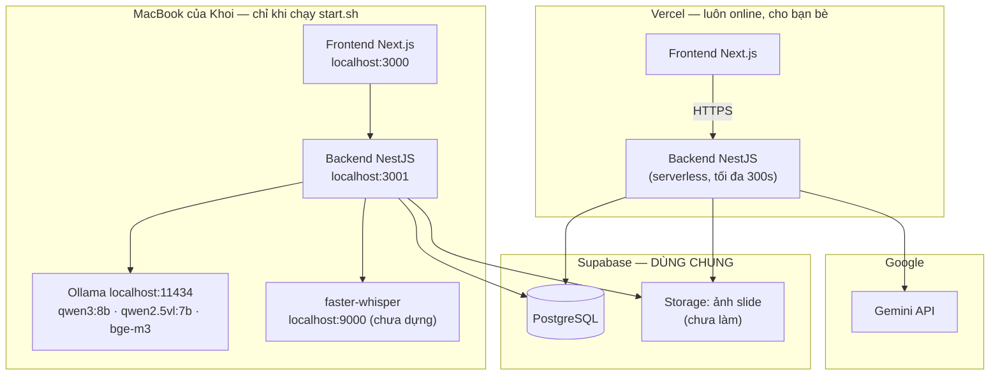
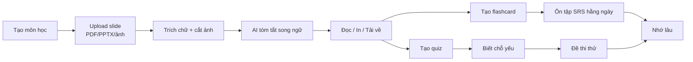

# tech.md — Bản đồ kỹ thuật & yêu cầu sản phẩm

> **AI ĐỌC FILE NÀY TRƯỚC TIÊN.** Đây là nguồn sự thật duy nhất về sản phẩm.
> Đọc xong file này, đọc tiếp `process.md` để biết đã làm được đến đâu.
> Cập nhật lần cuối: 2026-09-08 (sau đợt audit toàn bộ + đợt sửa lỗi P0 thứ nhất).

---

## 0. QUY TẮC BẮT BUỘC CHO AI

Đọc kỹ 9 quy tắc này. Vi phạm là làm hỏng sản phẩm.

0. **KHÔNG BAO GIỜ viết mật khẩu, khoá API, token vào bất kỳ file nào — kể cả khi người dùng đưa giá trị thật và bảo "làm giùm".** Bí mật chỉ đi từ tay chủ dự án vào `backend/.env` qua `./scripts/set-ai-key.sh` hoặc `./scripts/set-db.sh` (ô nhập không hiện chữ). Mọi bí mật đã xuất hiện trong khung chat, ảnh chụp màn hình, hay log **coi như đã lộ** → phải thu hồi và tạo lại, không có ngoại lệ. Khi in ra màn hình phải che (`AIza••••••••cdef`).

1. **Luôn đọc `tech.md` + `process.md` trước khi viết dòng code đầu tiên.** Không audit lại toàn bộ repo — `process.md` đã ghi sẵn hiện trạng.
2. **Mỗi khi hoàn thành một việc, PHẢI ghi vào `process.md`** theo mẫu ở mục 14. Không ghi = lần sau tốn hàng giờ audit lại.
3. **README đã được viết lại đúng thực tế (2026-09-08).** Bản cũ mô tả Redis, BullMQ, S3, Railway, thư mục `queue/` — không thứ nào tồn tại. Nếu gặp tài liệu nào còn nhắc tới chúng, đó là tài liệu cũ.
4. **Không dùng OpenAI API.** Sản phẩm chạy trên hai nhà cung cấp khác: **Gemini** ở bản Vercel và **Qwen qua Ollama** ở bản trên máy. Cả hai đều nói giao thức OpenAI, nên đổi nhà cung cấp là đổi biến môi trường — KHÔNG viết code riêng cho từng bên. Xem mục 4.1.
5. **Ngôn ngữ giao diện: 100% tiếng Việt.** Nội dung học thuật giữ tiếng Anh + chú thích tiếng Việt (đây là lõi giá trị sản phẩm, xem mục 2).
6. **Không thêm dependency mới nếu chưa ghi lý do vào `process.md`.** Ưu tiên thư viện đã có.
7. **Sau mỗi thay đổi: chạy `npx tsc --noEmit` ở cả `backend/` và `frontend/`.** Phải sạch lỗi mới coi là xong.
8. **Không xoá dữ liệu người dùng khi migrate.** Đã có người dùng thật trên Supabase.

---

## 1. SẢN PHẨM LÀ GÌ

**Tên:** AI Study OS
**Một câu:** Trợ lý học tập biến slide bài giảng tiếng Anh của giảng viên thành bản tóm tắt song ngữ, flashcard ôn tập và đề thi thử — dành cho sinh viên Việt Nam học chương trình tiếng Anh.

**Tuyên ngôn định vị (giữ nguyên, đừng đi chệch):**
> Định nghĩa và thuật ngữ **giữ nguyên tiếng Anh** (vì đi thi phải viết tiếng Anh).
> Phần giải thích, chú thích, gợi ý ôn thi **bằng tiếng Việt** (vì phải hiểu mới nhớ).

Đây là điều **NotebookLM, Quizlet, StudyFetch, Anki đều không làm**. Mọi tính năng mới phải trả lời được: *"nó có làm mạnh thêm lợi thế song ngữ này không?"* Nếu không, hạ ưu tiên.

---

## 2. NGƯỜI DÙNG & BỐI CẢNH

| Mục | Thực tế |
|---|---|
| Người dùng | Chủ sản phẩm (sinh viên kiến trúc) + bạn bè cùng lớp, ước tính 10–50 người |
| Không phải | Sản phẩm thương mại. **Không** làm thanh toán, gói cước, marketing site |
| Thiết bị | Laptop và điện thoại **quan trọng ngang nhau** → phải responsive thật, không phải "cho có" |
| Tài liệu đầu vào | Slide giảng viên: (a) chữ + gạch đầu dòng, (b) **nhiều ảnh/bản vẽ ít chữ** (mặt bằng, phối cảnh, ảnh công trình) |
| Ngôn ngữ | Giao diện tiếng Việt; nội dung slide tiếng Anh |
| Model AI | **Qwen chạy local qua Ollama trên MacBook Pro M4 Pro, 24GB** — miễn phí, nhưng chậm hơn cloud. Thông số máy đã kiểm chứng: xem §4.5 |

**Hệ quả thiết kế quan trọng:** vì slide nhiều hình, đường xử lý ảnh (mục 8.2) **không phải tính năng phụ mà là đường chính**. Một bản tóm tắt chỉ có chữ là vô dụng với môn kiến trúc.

---

## 3. HIỆN TRẠNG TỪNG MODULE

Cập nhật 2026-09-08. Khi thay đổi, sửa bảng này VÀ ghi vào `process.md`.

| Module | Backend | Frontend | Ghi chú |
|---|---|---|---|
| Auth (đăng ký/đăng nhập) | ✅ Xong | ✅ Xong | Thiếu: quên mật khẩu, đổi mật khẩu, xoá tài khoản |
| Subjects + Slide Summarizer | ✅ Xong | ✅ Xong | **Module lõi.** Chưa xử lý ảnh, chưa bất đồng bộ |
| Flashcard SRS (ôn tập) | ✅ Xong | ✅ Xong | Thuật toán SM-2 thô, thiếu bước học lại trong ngày |
| Quiz | ✅ Xong | ✅ Xong | ~~Luôn trả 400~~ đã sửa 2026-09-08. Hỗ trợ cả tự luận. Còn thiếu màn hình danh sách quiz |
| Lecture (bài giảng) | ✅ Xong | ✅ Đã nối | Ngôn ngữ Whisper đã cấu hình được; **còn phải dựng sidecar faster-whisper**. Vẫn đồng bộ → timeout |
| Essay Engine | ✅ Xong | ❌ **Giao diện giả** | `essay/page.tsx` chờ 3 giây rồi hiện văn bản cứng |
| AI Tutor (chat) | ✅ Xong | ❌ **Giao diện giả** | `tutor/page.tsx` trả lời cứng, không gọi API |
| RAG (tìm kiếm tài liệu) | ⚠️ Sai | — | Chưa từng index slide/lecture. Xem BUG-09 |
| Dashboard | ✅ Xong | ✅ Xong | Không hiển thị slide — thiếu module lõi |

**Tóm lại: backend đã làm ~85%, frontend mới nối ~60%.**

---

## 4. KIẾN TRÚC HỆ THỐNG

### 4.1 Quyết định kiến trúc quan trọng nhất (đọc kỹ)

**CHỐT 2026-09-08 — sản phẩm chạy ở HAI NƠI, dùng CHUNG một database.**

| | Bản trên Vercel | Bản trên máy Khoi |
|---|---|---|
| Địa chỉ | `https://<frontend>.vercel.app` | `http://localhost:3000` |
| Ai dùng | **Bạn bè cùng lớp** + Khoi khi đi ra ngoài | **Riêng Khoi**, khi ngồi ở MacBook |
| Bộ não AI | **Gemini** (đám mây Google) | **Qwen qua Ollama** (máy Khoi) |
| Luôn online? | Có | Chỉ khi chạy `./scripts/start.sh` |
| Chi phí | Hạn mức miễn phí của Gemini API | 0đ |
| Database | Supabase — **CÙNG MỘT CÁI** | Supabase — **CÙNG MỘT CÁI** |

Vì dùng chung database, môn học / slide / flashcard của Khoi **giống hệt nhau ở
cả hai nơi**. Tóm tắt một slide bằng Qwen ở nhà, mở điện thoại ra vẫn thấy.

**Vì sao KHÔNG cho bản Vercel gọi về Qwen ở nhà** (đã cân nhắc và loại):

- Qwen 8B trên MacBook xử lý **lần lượt từng người**. 10 bạn cùng bấm "tóm tắt"
  → người cuối chờ 20–30 phút, MacBook nóng và tụt pin suốt thời gian đó.
- Phải mở Ollama ra Internet. Ollama **không có mật khẩu** — cần dựng thêm một
  lớp chặn, tức thêm code và thêm bề mặt tấn công.
- Vercel cho tối đa **300 giây** mỗi lời gọi (xem đính chính bên dưới). Qwen qua
  đường hầm cho một slide dài mất 2–5 phút — sát mép; Essay Engine (5 lần gọi
  liên tiếp) thì vượt hẳn.

Đổi lại, cách hiện tại **không cần viết thêm một dòng code nào** cho phần hạ
tầng: cả hai bản đã dùng chung một mã nguồn, chỉ khác biến môi trường.

**Nhược điểm phải chấp nhận:** muốn dùng Qwen thì phải ngồi ở MacBook và mở
`localhost:3000`. Không dùng Qwen từ điện thoại được.

⚠️ **Đính chính 2026-09-08 (giữ lại để không ai lặp lại):** trước đây tài liệu
này ghi "Vercel giới hạn 60 giây" — **sai**. Con số 60 là do chính
`backend/vercel.json` của dự án tự đặt (`maxDuration: 60`, nay đã sửa thành
300). Vercel gói Hobby với fluid compute cho tới **300 giây**. Bài học: *một
con số nằm trong file cấu hình của chính dự án không phải là giới hạn của nền
tảng.*

**Chi phí Gemini — đọc kỹ kẻo hiểu nhầm:** gói thuê bao **Google AI Pro /
Ultra** (mua trong app Gemini hoặc Google One) **không** cấp hạn mức cho API
key. Google ghi rõ quyền lợi của gói chỉ áp dụng *trong giao diện web* của
Gemini và AI Studio; gọi API từ ứng dụng ngoài được tính tiền riêng. Backend
này gọi bằng API key → chạy theo **hạn mức miễn phí của API**, hoặc
trả-theo-lượt nếu bật thanh toán ở Google Cloud. Hạn mức thật của tài khoản
xem tại https://aistudio.google.com/rate-limit (Google không còn công bố con
số trong tài liệu).

**Làm sao biết mình đang ở bản nào?** Giao diện có huy hiệu ở góc
(`frontend/src/components/AiBadge.tsx`) đọc từ `/v1/health`:

| Huy hiệu | Nghĩa |
|---|---|
| 🟢 `Qwen · máy bạn` | Backend đang chạy trên MacBook, dùng Ollama |
| 🔵 `Gemini · đám mây` | Backend trên Vercel, dùng Gemini |
| 🔴 `Máy chủ chưa bật` | Đang mở localhost:3000 nhưng chưa chạy `start.sh` |

### 4.2 Sơ đồ



### 4.2b Biến môi trường: đặt ở đâu, giá trị nào

Đây là chỗ dễ sai nhất. **Hai nơi, hai bộ giá trị khác nhau**, không được lẫn.

**A. Bản trên máy** — file `backend/.env` (không bao giờ đẩy lên GitHub):

| Biến | Giá trị |
|---|---|
| `OPENAI_BASE_URL` | `http://127.0.0.1:11434/v1` |
| `OPENAI_API_KEY` | `ollama` (Ollama không kiểm tra, nhưng SDK bắt buộc có) |
| `OPENAI_MODEL` | `qwen3:8b` |
| `OPENAI_VISION_MODEL` | `qwen2.5vl:7b` |
| `OPENAI_EMBEDDING_MODEL` | `bge-m3` |
| `CORS_ORIGINS` | `http://localhost:3000` |
| `DATABASE_URL` / `DIRECT_URL` | Chuỗi Supabase (giống hệt bên Vercel) |

**B. Bản trên Vercel** — Vercel → dự án **backend** → Settings → Environment
Variables. Nhập bằng tay trên web, **không** qua file:

| Biến | Giá trị |
|---|---|
| `OPENAI_BASE_URL` | `https://generativelanguage.googleapis.com/v1beta/openai` |
| `OPENAI_API_KEY` | Khoá lấy ở aistudio.google.com/apikey |
| `OPENAI_MODEL` | Tên model Gemini — **chạy `./scripts/check-ai.sh` để biết tên đúng** |
| `OPENAI_VISION_MODEL` | Cùng tên với `OPENAI_MODEL` (Gemini đọc ảnh bằng model chat) |
| `OPENAI_EMBEDDING_MODEL` | Model embedding của Gemini |
| `CORS_ORIGINS` | `https://<frontend>.vercel.app` — thiếu là BUG-10 |
| `DATABASE_URL` / `DIRECT_URL` | Chuỗi Supabase (giống hệt bên máy) |
| `JWT_SECRET` | **Phải giống hệt bên máy**, nếu không token đăng nhập ở nơi này sẽ bị nơi kia từ chối |

Và Vercel → dự án **frontend** → `NEXT_PUBLIC_API_URL` = `https://<backend>.vercel.app/v1`

⚠️ **Bẫy `frontend/.env.production`:** file này nằm trong repo và ghi cứng địa
chỉ backend. Nó **không ảnh hưởng** khi chạy `start.sh` (vì `next dev` không
đọc `.env.production`), nhưng nếu ai đó chạy `next build && next start` trên
máy thì frontend local sẽ gọi thẳng lên backend Vercel → tưởng dùng Qwen mà
thật ra đang dùng Gemini. Huy hiệu ở §4.1 chính là để bắt được ca này.

Kiểm tra toàn bộ sau khi deploy:

```bash
./scripts/check-deploy.sh https://<backend>.vercel.app https://<frontend>.vercel.app
```

### 4.3 Ngăn xếp công nghệ (thực tế, không phải theo README cũ)

| Tầng | Công nghệ | Ghi chú |
|---|---|---|
| Frontend | Next.js 14.2 (App Router), React 18, TypeScript | Deploy Vercel |
| UI | Tailwind CSS 3.4, shadcn/ui (Base UI), lucide-react, framer-motion | |
| Backend | NestJS 11, TypeScript strict | Chạy ở **cả hai nơi**: Vercel (bạn bè) và localhost (Khoi) — §4.1 |
| ORM | Prisma 6.19 | Migration thật, có `prisma/deploy.js` xử lý baseline |
| DB | PostgreSQL trên Supabase | `DATABASE_URL` pooled 6543 + `DIRECT_URL` 5432 |
| Lưu file | Supabase Storage (bucket `slide-assets`) | **Chưa làm — cần thêm** |
| AI text | Vercel: **Gemini** · Máy: Ollama `qwen3:8b` | Cùng giao thức OpenAI nên đổi nhà cung cấp = đổi biến môi trường, không đổi code |
| AI vision | Vercel: Gemini · Máy: `qwen2.5vl:7b` | Đọc slide dạng ảnh, bản vẽ |
| AI embedding | Vercel: Gemini · Máy: `bge-m3` | ⚠️ Số chiều KHÁC NHAU giữa hai bên — xem cảnh báo §4.3b |
| Speech-to-text | `faster-whisper` chạy sidecar Python | Ollama **không** làm audio |
| Auth | JWT (Passport) + bcryptjs | Token trong localStorage |
| ~~Đường hầm~~ | ~~Cloudflare Tunnel~~ | **Đã bỏ 2026-09-08** — xem §4.7 |
| **KHÔNG dùng** | ~~Redis~~ ~~BullMQ~~ ~~S3~~ ~~Railway~~ ~~Docker Compose~~ | README cũ nói dối |

### 4.3b ⚠️ Bẫy chưa xử lý: embedding hai bên khác số chiều

`bge-m3` (Ollama) cho vector **1024 chiều**. Model embedding của Gemini cho số
chiều khác. Nếu một phần tài liệu được đánh chỉ mục bằng máy và phần còn lại
bằng Vercel, hai loại vector **không so sánh được với nhau** — tìm kiếm tài
liệu (RAG, BUG-09) sẽ trả về kết quả sai mà không báo lỗi gì.

Chưa xử lý vì RAG thật chưa làm. **Khi làm BUG-09 phải chốt một trong hai:**

1. Chỉ đánh chỉ mục ở một nơi (khuyến nghị: Vercel/Gemini, vì luôn online), hoặc
2. Lưu kèm tên model + số chiều vào mỗi vector, chỉ so những vector cùng model.

Ghi lại đây để lần sau không mất buổi gỡ lỗi "sao tìm kiếm ra kết quả vớ vẩn".

### 4.4 Biến môi trường (backend/.env)

```env
# Database (Supabase)
DATABASE_URL="postgresql://...@...pooler.supabase.com:6543/postgres?pgbouncer=true&connection_limit=1"
DIRECT_URL="postgresql://...@...pooler.supabase.com:5432/postgres"

# Auth
JWT_SECRET="chuỗi ngẫu nhiên dài"
JWT_EXPIRATION="7d"

# AI — Ollama local (tương thích OpenAI)
OPENAI_BASE_URL="http://127.0.0.1:11434/v1"
OPENAI_API_KEY="ollama"              # Ollama không kiểm tra, nhưng SDK bắt buộc có
OPENAI_MODEL="qwen3:8b"
OPENAI_FALLBACK_MODEL="qwen2.5:7b"   # máy đã có sẵn, không cần tải thêm
OPENAI_VISION_MODEL="qwen2.5vl:7b"   # ✅ code đã đọc biến này
OPENAI_EMBEDDING_MODEL="bge-m3"

# Speech-to-text sidecar
WHISPER_URL="http://127.0.0.1:9000"  # ✅ code đã đọc; sidecar chưa dựng
WHISPER_LANGUAGE="auto"              # ✅ code đã đọc — KHÔNG được hardcode 'en'

# Lưu file
SUPABASE_URL="https://xxx.supabase.co"          # MỚI
SUPABASE_SERVICE_KEY="..."                       # MỚI
SUPABASE_BUCKET="slide-assets"                   # MỚI

# App
API_PREFIX=v1
PORT=3001
CORS_ORIGINS="https://<frontend>.vercel.app,http://localhost:3000"  # PHẢI DÙNG, xem BUG-10
THROTTLE_TTL=60
THROTTLE_LIMIT=100
AI_DAILY_LIMIT_PER_USER=60           # MỚI — chống lạm dụng
```

**Lệnh cài model (chạy một lần trên MacBook):**
```bash
ollama pull qwen3:8b
ollama pull qwen2.5vl:7b
ollama pull bge-m3
```

**Lưu ý Ollama quan trọng:** Ollama hỗ trợ `response_format: {type:"json_object"}` **không ổn định bằng** OpenAI. Bắt buộc phải có lớp sửa JSON (mục 9.3).

---

### 4.5 Phần cứng thực tế và cấu hình model đã chốt

Kiểm chứng trực tiếp trên máy ngày 2026-09-08 (đọc `~/.ollama/logs/server.log`):

| Hạng mục | Giá trị thật |
|---|---|
| Máy | MacBook Pro — **Apple M4 Pro** |
| RAM hợp nhất | **24 GB** |
| Ngân sách GPU (Metal) | **17.8 GiB** khả dụng cho model |
| Ổ đĩa trống | ~242 GB |
| Ollama | **0.33.2** |
| Model đang có | **`qwen2.5:7b`** — Q4_K_M, 7.6B tham số, 4.4 GB (tải 2026-09-01) |
| Model còn thiếu | Qwen3 · model đọc ảnh · model embedding — **chưa có cái nào** |

**Cần tải thêm (tổng ~12 GB):**

```bash
ollama pull qwen3:8b        # ~5.2 GB — model sinh văn bản chính
ollama pull qwen2.5vl:7b    # ~6.0 GB — đọc slide ảnh, bản vẽ (BẮT BUỘC cho slide kiến trúc)
ollama pull bge-m3          # ~1.2 GB — embedding đa ngữ Việt–Anh, cho RAG
```

**Vì sao `qwen3:8b` chứ không phải `qwen3:14b`:** 14b tốn khoảng 9 GB, cộng thêm model đọc ảnh 6 GB là 15 GB — sát trần 17.3 GiB, chưa kể macOS và trình duyệt cũng đang dùng RAM. Log cho thấy máy thường chỉ còn **4–6 GB RAM trống** (chủ máy chạy nhiều công cụ lập trình cùng lúc). Với 8b thì tổng cả ba model ≈ 12.4 GB — vẫn còn khoảng thở. M4 Pro chạy 8b đủ nhanh.

**Vì sao giữ `qwen2.5:7b` làm model dự phòng:** máy đã có sẵn, không tốn thêm dung lượng tải.

**Cấu hình Ollama nên đặt** (thêm vào `~/.zshrc`):

```bash
export OLLAMA_MAX_LOADED_MODELS=2   # đừng giữ cả 3 model trong RAM cùng lúc
export OLLAMA_KEEP_ALIVE=15m        # tránh nạp lại model liên tục giữa các bước
```

---

### 4.6 Bật hệ thống: hai script

Toàn bộ việc khởi động đã đóng gói vào `scripts/`. Không cần nhớ lệnh nào khác.

| Lệnh | Khi nào dùng |
|---|---|
| `./scripts/setup-mac.sh` | **Một lần duy nhất.** Kiểm tra Node/Ollama, tải 3 model, đặt biến môi trường Ollama, tạo `.env`, cài thư viện, cập nhật cấu trúc database |
| `./scripts/start.sh` | **Mỗi lần muốn dùng.** Bật backend + giao diện ở `localhost:3000` |
| `./scripts/start.sh --share` | Như trên, cộng thêm đường hầm Cloudflare để bạn bè truy cập |
| `./scripts/start.sh --api-only` | Chỉ backend — khi giao diện đã chạy trên Vercel |
| `./scripts/set-ai-key.sh` | **Nhập khoá API AI.** Ô nhập không hiện chữ, ghi thẳng vào `backend/.env`, không in khoá ra màn hình |
| `./scripts/set-db.sh` | Nhập mật khẩu database Supabase (cùng cách an toàn) |
| `./scripts/check-ai.sh` | Sau khi đổi nhà cung cấp hoặc đổi khoá — kiểm tra kết nối và **tên model có thật không** |
| `./scripts/check-deploy.sh` | Sau khi deploy — kiểm tra bản Vercel: database, đúng Gemini, CORS, frontend trỏ đúng chỗ |

`start.sh` tự kiểm tra trước khi chạy và **dừng lại với thông báo rõ ràng bằng tiếng Việt** nếu: Ollama chưa bật · thiếu model · `.env` chưa điền · cổng bị chiếm · biên dịch lỗi. Nó chỉ biên dịch lại khi mã nguồn thực sự mới hơn bản build. Ctrl+C tắt sạch mọi tiến trình con.

Log ghi ở `.logs/` (đã cho vào `.gitignore`).

**Cạm bẫy đã xử lý:** `ollama pull bge-m3` tạo ra model tên `bge-m3:latest`, không phải `bge-m3`. Nếu so khớp chính xác thì script báo thiếu model vĩnh viễn dù đã cài đúng. Hàm `ollama_has_model` trong `scripts/lib.sh` chấp nhận cả hai dạng — đừng "tối ưu" nó thành so sánh chính xác.

### 4.7 Đường hầm ra Internet — ĐÃ BỎ (giữ lại để không ai làm lại)

`start.sh --share` mở một **Cloudflare quick tunnel** để bạn bè gọi thẳng vào
backend trên MacBook. Từ 2026-09-08, **không dùng nữa**: bạn bè đã có bản
Vercel + Gemini luôn online (§4.1), nên không cần MacBook bật.

Tuỳ chọn `--share` vẫn còn trong `start.sh` cho trường hợp hiếm — muốn cho một
người xem thử bản đang sửa dở trên máy. Nếu dùng, nhớ:

- Địa chỉ quick tunnel **đổi mỗi lần bật lại** → phải sửa `NEXT_PUBLIC_API_URL`
  và deploy lại. Muốn địa chỉ cố định thì `tailscale funnel --bg 3001`.
- Đường hầm này chĩa vào **backend NestJS** (đã có đăng nhập JWT), **không bao
  giờ** chĩa thẳng vào Ollama cổng 11434 — Ollama không có mật khẩu, ai có địa
  chỉ là dùng được máy bạn.

### 4.8 Deploy lên Vercel — làm theo đúng thứ tự

Hai dự án Vercel riêng, cùng trỏ vào một repo GitHub:

1. **Dự án backend** — Root Directory = `backend/`
   - Điền biến môi trường theo bảng B ở §4.2b
   - Deploy, ghi lại địa chỉ `https://<backend>.vercel.app`
2. **Dự án frontend** — Root Directory = `frontend/`
   - `NEXT_PUBLIC_API_URL` = `https://<backend>.vercel.app/v1` (**nhớ `/v1`**)
   - Deploy, ghi lại địa chỉ `https://<frontend>.vercel.app`
3. Quay lại dự án **backend**, đặt `CORS_ORIGINS` = `https://<frontend>.vercel.app`,
   deploy lại. (Phải làm sau bước 2 vì lúc đó mới biết địa chỉ frontend.)
4. Kiểm tra:
   ```bash
   ./scripts/check-deploy.sh https://<backend>.vercel.app https://<frontend>.vercel.app
   ```

**`JWT_SECRET` phải giống hệt ở hai nơi.** Token cấp bởi bản này mà bản kia
không nhận thì đăng nhập ở localhost xong mở Vercel sẽ bị đá ra.


---

## 5. BẢN ĐỒ MÃ NGUỒN

```
learning_AI/
├── tech.md              ← FILE NÀY
├── process.md           ← Nhật ký tiến độ, PHẢI cập nhật
├── README.md            ← ĐANG SAI, cần viết lại
├── ROADMAP.md           ← Lỗi thời, nên xoá (đã gộp vào tech.md mục 11)
├── docker-compose.yml   ← Có service redis không dùng, cần dọn
├── scripts/                        (bật hệ thống — xem §4.6)
│   ├── lib.sh                      Hàm dùng chung: kiểm tra Ollama, đọc .env, đợi URL
│   ├── setup-mac.sh                Cài đặt lần đầu
│   └── start.sh                    Bật hằng ngày (+ tuỳ chọn --share)
│
├── backend/                        (NestJS, chạy trên MacBook)
│   ├── prisma/
│   │   ├── schema.prisma           ← Mô hình dữ liệu, xem mục 6
│   │   ├── migrations/             ← 3 migration, đừng sửa file cũ
│   │   └── deploy.js               ← Script migrate an toàn (baseline legacy DB)
│   └── src/
│       ├── main.ts                 ← Bootstrap thường (dùng khi self-host) ✅
│       ├── serverless.ts           ← Bootstrap Vercel (sẽ bỏ khi chuyển self-host)
│       ├── app.module.ts           ← Đăng ký module + guard toàn cục
│       ├── ai/ai.service.ts        ← ⭐ Mọi lệnh gọi AI đi qua đây
│       ├── auth/                   ← JWT, đăng ký, đăng nhập
│       ├── slides/                 ← ⭐ MODULE LÕI
│       │   ├── slide.controller.ts     Upload, xem, xoá, tải về, tạo flashcard/quiz
│       │   ├── slide.service.ts        Logic tóm tắt
│       │   ├── slide-parser.ts         Đọc PDF (pdf-parse) / PPTX (adm-zip) / text
│       │   ├── summary.types.ts        Kiểu dữ liệu bản tóm tắt
│       │   ├── summary-renderer.ts     Xuất Markdown + HTML in được
│       │   ├── subject.controller.ts   CRUD môn học
│       │   └── subject.service.ts
│       ├── learning/               ← Flashcard SRS + Quiz + Dashboard
│       ├── lecture/                ← Upload audio → transcript → insight
│       ├── essay/                  ← Sinh & chấm bài luận theo rubric
│       ├── tutor/                  ← Chat RAG, giải thích, giải bài
│       ├── health/                 ← GET /v1/health (công khai)
│       └── common/                 ← Filter lỗi, interceptor bọc response, decorator
│
└── frontend/                       (Next.js, deploy Vercel)
    └── src/
        ├── app/
        │   ├── layout.tsx          ← Font, AuthProvider, AppShell
        │   ├── globals.css         ← Biến màu + tiện ích glass
        │   ├── page.tsx            ← Dashboard ✅ thật
        │   ├── subjects/page.tsx   ← ⚠️ 733 dòng, 5 màn hình trong 1 file, không có URL riêng
        │   ├── review/page.tsx     ← Ôn tập SRS ✅ thật
        │   ├── lecture/page.tsx    ← ✅ thật
        │   ├── essay/page.tsx      ← ❌ GIẢ
        │   └── tutor/page.tsx      ← ❌ GIẢ
        ├── components/
        │   ├── AppShell.tsx        ← Sidebar + bottom nav + màn hình đăng nhập
        │   ├── QuizRunner.tsx      ← Làm quiz (chỉ hỗ trợ trắc nghiệm)
        │   └── ui/                 ← shadcn: button, card, input, dialog...
        └── lib/
            ├── api.ts              ← ⭐ Client gọi API, tự bóc vỏ {success,data}
            └── auth.tsx            ← Context đăng nhập
```

---

## 6. MÔ HÌNH DỮ LIỆU

Nguồn chuẩn: `backend/prisma/schema.prisma`. Tóm tắt quan hệ:

```
User ──┬─< Subject ──< SlideSession ──< Flashcard
       │                    │
       │                    └──< SlideAsset (MỚI, chưa có)
       ├─< Lecture ──< Flashcard, Quiz
       ├─< Essay
       ├─< Quiz
       ├─< ChatSession
       ├─< AIContext        (kho vector cho RAG)
       └── StudyStats (1-1)
```

### Bảng quan trọng

| Bảng | Vai trò | Vấn đề đã biết |
|---|---|---|
| `SlideSession` | Một lần upload slide + bản tóm tắt | `summary` (Json) + `summaryMarkdown` (text). `extractedText` cắt cứng ở 40.000 ký tự, **âm thầm mất dữ liệu** |
| `Flashcard` | Thẻ ôn tập SM-2 | `easeFactor`, `interval`, `repetitions`, `nextReviewDate` |
| `Quiz` | Bộ câu hỏi + điểm | **Thiếu `sourceSlideSessionId`** → quiz tạo từ slide là mồ côi, không mở lại được |
| `AIContext` | Vector cho RAG | `embedding` lưu dạng Json → tìm kiếm phải nạp toàn bộ vào RAM. Xem BUG-09 |
| `StudyStats` | Streak, thời gian học | `weakTopics`, `retentionScore`, `dailyGoal`, `weeklyStats` **chưa bao giờ được ghi** |
| `JobRecord` | Theo dõi job nền | **Code chết** — model có nhưng chưa bao giờ dùng. Sẽ dùng khi làm hàng đợi (mục 11.P1) |

### Bảng cần THÊM

```prisma
// Ảnh cắt ra từ slide — bắt buộc cho slide kiến trúc
model SlideAsset {
  id             String   @id @default(uuid())
  slideSessionId String
  slideSession   SlideSession @relation(fields: [slideSessionId], references: [id], onDelete: Cascade)
  pageNumber     Int      // trang/slide số mấy
  orderInPage    Int      @default(0)
  storageKey     String   // đường dẫn trong Supabase Storage
  publicUrl      String?
  width          Int?
  height         Int?
  captionEn      String?  @db.Text  // AI mô tả ảnh (tiếng Anh)
  captionVi      String?  @db.Text  // chú thích tiếng Việt
  kind           String   @default("figure") // figure | diagram | photo | plan
  createdAt      DateTime @default(now())

  @@index([slideSessionId, pageNumber])
  @@map("slide_assets")
}

// Từ điển thuật ngữ cá nhân (module mới)
model GlossaryTerm {
  id           String   @id @default(uuid())
  userId       String
  user         User     @relation(fields: [userId], references: [id], onDelete: Cascade)
  subjectId    String?
  term         String                       // tiếng Anh
  normalized   String                       // lowercase, để chống trùng
  definitionEn String   @db.Text
  glossVi      String   @db.Text
  seenCount    Int      @default(1)
  sourceIds    Json?                        // mảng slideSessionId đã gặp
  createdAt    DateTime @default(now())
  updatedAt    DateTime @updatedAt

  @@unique([userId, normalized])
  @@index([userId, subjectId])
  @@map("glossary_terms")
}

// Chia sẻ môn học cho cả lớp (module mới)
model SubjectShare {
  id         String   @id @default(uuid())
  subjectId  String
  ownerId    String
  shareCode  String   @unique             // mã 8 ký tự để mời
  role       String   @default("viewer")  // viewer | contributor
  createdAt  DateTime @default(now())

  @@index([subjectId])
  @@map("subject_shares")
}
```

Ngoài ra **thêm cột**: `Quiz.sourceSlideSessionId String?`, `Quiz.subjectId String?`, `SlideSession.pageCount Int?`, `SlideSession.truncated Boolean @default(false)`.

---

## 7. DANH SÁCH API

Tiền tố: `/v1`. Mọi route **mặc định yêu cầu JWT** (guard toàn cục), trừ route gắn `@Public()`.

**Mọi response được bọc:** `{ success: true, data: <kết quả>, timestamp }` — do `TransformInterceptor`. Frontend `lib/api.ts` tự bóc một lớp `data`. ⚠️ Cạm bẫy: một số service **tự trả `{data: [...]}`** → thành hai lớp lồng nhau. Xem mục 9.1.

### Auth
| Method | Đường dẫn | Mô tả |
|---|---|---|
| POST | `/auth/register` | 🔓 Đăng ký. Mật khẩu ≥ 8 ký tự |
| POST | `/auth/login` | 🔓 Đăng nhập → `{accessToken, user}` |
| GET | `/auth/profile` | Thông tin + số lượng essay/lecture/flashcard/quiz |

### Subjects & Slides (module lõi)
| Method | Đường dẫn | Mô tả |
|---|---|---|
| POST | `/subjects` | Tạo môn học |
| GET | `/subjects` | Danh sách (trả `{data:[...]}` → hai lớp) |
| GET | `/subjects/:id` | Chi tiết + danh sách slide session |
| PATCH | `/subjects/:id` | Sửa tên/màu/mô tả |
| DELETE | `/subjects/:id` | Xoá, **cascade xoá hết slide session** |
| POST | `/subjects/:subjectId/slides` | Upload file (multipart, field `file`), tối đa 25MB. Chấp nhận: pdf, pptx, image/*, text/plain, text/markdown |
| GET | `/slides/:id` | Xem session + summary |
| DELETE | `/slides/:id` | Xoá session |
| GET | `/slides/:id/download?format=md\|html` | Tải bản tóm tắt (bỏ qua interceptor) |
| POST | `/slides/:id/flashcards` | Sinh flashcard từ `keyTerms` (không gọi AI) |
| POST | `/slides/:id/quiz` | Sinh 6 câu trắc nghiệm (gọi AI) |

### Learning (ôn tập & quiz)
| Method | Đường dẫn | Mô tả |
|---|---|---|
| GET | `/learning/dashboard` | Streak, thẻ cần ôn, essay/lecture gần đây, điểm quiz TB |
| GET | `/learning/weak-topics` | Phân tích điểm yếu (đắt, chưa có UI) |
| GET | `/flashcard/due?limit=N` | Thẻ đến hạn ôn |
| POST | `/flashcard/review` | `{flashcardId, quality:0-3}` → SM-2 |
| POST | `/quiz/submit` | ⚠️ **ĐANG HỎNG** — xem BUG-01 |
| GET | `/quiz/generate` | ⚠️ Sai method: GET nhưng tạo dữ liệu + tốn AI. Phải đổi thành POST |

### Lecture
| Method | Đường dẫn | Mô tả |
|---|---|---|
| POST | `/lecture/upload` | multipart field `audio` (≤25MB) hoặc `transcript` dạng text |
| POST | `/lecture/process` | `{lectureId, focusTopics?}` → làm sạch + trích xuất + sinh flashcard/quiz |
| GET | `/lecture` | Danh sách (phân trang) |
| GET | `/lecture/:id` | Chi tiết + flashcard + quiz |
| GET | `/lecture/:id/flashcards` \| `/quiz` | Tài liệu sinh ra |

### Essay
| Method | Đường dẫn | Mô tả |
|---|---|---|
| POST | `/essay/generate` | `{prompt, rubric}` → 5 lần gọi AI liên tiếp (**rất chậm**) |
| POST | `/essay/improve` | `{essayId, focusAreas?, targetScore?}` |
| GET | `/essay` \| `/essay/:id` | Danh sách / chi tiết |

### AI Tutor
| Method | Đường dẫn | Mô tả |
|---|---|---|
| POST | `/ai/chat` | `{message, sessionId?}` → chat có RAG |
| POST | `/ai/explain` | `{topic, level?}` → giải thích đa tầng (JSON) |
| POST | `/ai/solve` | `{problem, instructions?}` → giải từng bước (JSON) |

### Health
| Method | Đường dẫn | Mô tả |
|---|---|---|
| GET | `/health` | 🔓 Trạng thái + kết nối DB |
| GET | `/api/docs` | 🔓 Swagger UI (không có tiền tố `/v1`) |

### API cần THÊM
```
GET    /quiz                     Danh sách quiz đã tạo (đang không mở lại được!)
GET    /quiz/:id                 Mở lại một quiz
DELETE /lecture/:id              Xoá bài giảng
DELETE /essay/:id                Xoá bài luận
GET    /flashcard                Duyệt toàn bộ thẻ (sửa/xoá)
PATCH  /flashcard/:id            Sửa nội dung thẻ
DELETE /flashcard/:id            Xoá thẻ
POST   /slides/:id/retry         Chạy lại session bị treo/lỗi
GET    /search?q=                Tìm kiếm toàn cục có trích dẫn (RAG)
GET    /glossary                 Từ điển thuật ngữ cá nhân
POST   /subjects/:id/share       Tạo mã mời chia sẻ
POST   /subjects/join            Vào môn học bằng mã
POST   /subjects/:id/mock-exam   Sinh đề thi thử từ toàn bộ slide của môn
GET    /me/usage                 Số lượt gọi AI đã dùng hôm nay
```

---

## 8. LUỒNG NGHIỆP VỤ (WORKFLOW)

### 8.1 Luồng chính — "Slide → Nhớ được"

Đây là vòng lặp giá trị cốt lõi. Mọi thứ khác là phụ trợ.



**Chi tiết từng bước upload (hiện tại — ĐỒNG BỘ, cần đổi thành bất đồng bộ ở P1):**

1. `SlideController.uploadSlide` — multer nhận file vào RAM, kiểm tra MIME
2. `SubjectService.assertOwned` — kiểm tra môn học thuộc về user
3. `parseSlideFile` — theo loại file:
   - `pdf` → `pdf-parse` lấy text
   - `pptx` → `adm-zip` mở, đọc `ppt/slides/slideN.xml`, regex `<a:t>`
   - `image` → trả text rỗng, sẽ đọc bằng vision
   - `text` → đọc UTF-8
4. Tạo bản ghi `SlideSession` status `processing`
5. `resolveText` — nếu là ảnh, gọi `aiService.completeVision` để OCR
6. Kiểm tra ≥ 20 ký tự, cắt còn 40.000 ký tự
7. `summarize` — gọi AI trả JSON theo `SlideSummary`
8. `renderSummaryMarkdown` — dựng Markdown
9. Cập nhật session status `completed`

**Nếu bất kỳ bước nào lỗi:** status `failed` + `errorMessage`. **Nếu tiến trình chết giữa chừng:** status kẹt `processing` vĩnh viễn → BUG-05.

### 8.2 Luồng ẢNH (CẦN LÀM MỚI — quan trọng nhất với slide kiến trúc)

Đây là tính năng chủ sản phẩm yêu cầu rõ: *"cắt ảnh ra, chèn kèm trong bản tóm tắt"*.

**Cách làm được khuyến nghị:**

| Loại file | Cách lấy ảnh |
|---|---|
| **PPTX** | Ảnh nằm sẵn trong zip ở `ppt/media/`. File `ppt/slides/_rels/slideN.xml.rels` cho biết ảnh nào thuộc slide nào. Dùng `adm-zip` **đã có sẵn** — không cần thư viện mới. Đây là đường dễ nhất, làm trước. |
| **PDF** | Dùng `mupdf` (npm, thuần WASM, không cần cài native) để: (a) render mỗi trang thành PNG, (b) trích ảnh nhúng. Nếu chỉ cần "ảnh của trang", render trang là đủ và đơn giản hơn nhiều. |
| **Ảnh rời** | Chính nó là ảnh. |

**Quy trình đề xuất (xử lý theo TỪNG TRANG, không phải một cục text):**

```
Với mỗi trang/slide:
  1. Lấy text của trang
  2. Lấy ảnh của trang → upload Supabase Storage → tạo bản ghi SlideAsset
  3. Nếu trang có ảnh VÀ ít chữ (< 100 ký tự):
        → gọi qwen2.5vl mô tả ảnh (captionEn + captionVi)
     Nếu trang nhiều chữ:
        → chỉ dùng text, không gọi vision (tiết kiệm thời gian)
  4. Ghép: "## Slide 7\n<text>\n\n*<captionVi>*"
Sau đó tóm tắt toàn bộ như hiện tại, NHƯNG:
  - Mỗi `section` trong SlideSummary thêm trường `sourceSlides: number[]`
  - Mỗi `section` thêm `assetIds: string[]` để giao diện chèn ảnh đúng chỗ
```

Lợi ích kép: có ảnh trong bản tóm tắt **và** có được trích dẫn "ý này ở slide số mấy" — thứ NotebookLM đang thắng.

**Bổ sung quan trọng:** nếu PDF là bản scan (`pdf-parse` trả text gần rỗng), **phải tự động chuyển sang render trang → đọc bằng vision**, thay vì báo lỗi "Không đọc được nội dung" như hiện nay (BUG-06).

### 8.3 Luồng ôn tập SRS

```
GET /flashcard/due  →  hiện câu hỏi  →  bấm "Hiện đáp án"
  →  chọn Quên(0) / Khó(1) / Được(2) / Dễ(3)
  →  POST /flashcard/review
  →  calculateSM2(quality, repetitions, easeFactor, interval)
  →  cập nhật nextReviewDate  →  cập nhật streak  →  thẻ tiếp theo
```

Công thức SM-2 hiện tại:
- `EF_mới = EF + (0.1 - (3-q) × (0.08 + (3-q) × 0.02))`, sàn 1.3
- `q < 2` → reset: repetitions = 0, interval = 1
- `q ≥ 2` → repetitions++; lần 1 → 1 ngày, lần 2 → 6 ngày, lần 3+ → `interval × EF`

**Cần cải tiến (P2):** thêm bước học lại trong ngày (thẻ trả lời sai xuất hiện lại sau ~10 phút thay vì ngày mai). Cân nhắc chuyển sang **FSRS** — thuật toán Anki đang dùng, giảm 20–30% số lần ôn cho cùng mức nhớ.

### 8.4 Luồng RAG (CẦN LÀM LẠI — hiện đang sai)

**Sai hiện tại:** `tutor.service.ts` chỉ lưu **câu chat** vào `AIContext` (kể cả câu do AI tự trả lời → AI học lại lời mình nói). **Slide và bài giảng chưa bao giờ được index.** Nên câu quảng cáo "AI biết mọi tài liệu của bạn" là sai sự thật.

**Đúng phải là:**

```
Khi tóm tắt slide xong:
  → chia summaryMarkdown thành các đoạn ~500 token (chunk)
  → mỗi chunk: gọi bge-m3 tạo embedding
  → lưu AIContext { type:'slide', sourceId: slideSessionId,
                    metadata: { subjectId, slideTitle, pageNumbers } }

Khi user hỏi:
  → embedding câu hỏi
  → tìm chunk gần nhất
  → đưa vào prompt CÙNG VỚI nguồn
  → trả lời PHẢI kèm "Nguồn: <tên slide>, trang X"

KHÔNG lưu câu trả lời của AI vào kho vector.
```

**Vấn đề hiệu năng phải xử lý:** hiện tại `searchContext` nạp **toàn bộ** `AIContext` của user vào RAM rồi tính cosine bằng JavaScript. Vài nghìn bản ghi là sập. **Giải pháp:** bật extension `pgvector` trên Supabase (có sẵn, chỉ cần `CREATE EXTENSION vector;`), đổi cột `embedding` sang kiểu `vector(1024)`, tìm bằng SQL `ORDER BY embedding <=> $1 LIMIT 5`. Nhanh hơn hàng trăm lần.

---

## 9. QUY ƯỚC KỸ THUẬT & CẠM BẪY

Đọc mục này trước khi sửa code. Đây là những chỗ đã từng gây lỗi.

### 9.1 Vỏ bọc response hai lớp
`TransformInterceptor` bọc mọi thứ thành `{success, data, timestamp}`. Nhưng `SubjectService.list()` và `EssayService.getUserEssays()` **tự trả `{data, meta}`** → kết quả thành `{success, data:{data:[...], meta}}`.
**Quy ước từ nay:** service trả **thẳng mảng hoặc object**, không tự bọc `data`. Phân trang trả `{items, meta}` (đổi tên `data` → `items`). Sửa cả frontend tương ứng.

### 9.2 ValidationPipe cực nghiêm — nguyên nhân BUG-01
`main.ts` bật `whitelist: true` + `forbidNonWhitelisted: true`. Nghĩa là: **bất kỳ trường DTO nào không có decorator của `class-validator` sẽ bị coi là không hợp lệ và request bị từ chối 400.**
`@ApiProperty()` của Swagger **KHÔNG** tính là decorator kiểm tra.
→ **Mọi trường trong mọi DTO bắt buộc phải có ít nhất một decorator `@IsXxx()`.** Mảng lồng nhau phải có `@IsArray() @ValidateNested({each:true}) @Type(() => LopCon)`.

### 9.3 Gọi AI trả JSON với Ollama
Ollama hỗ trợ `response_format: json_object` không ổn định bằng OpenAI. `completeJSON` hiện chỉ bóc ```` ```json ```` rồi `JSON.parse` — sẽ vỡ thường xuyên với model local.
**Bắt buộc bổ sung vào `ai.service.ts`:**
1. Thử `JSON.parse` trực tiếp
2. Nếu lỗi: trích khối `{...}` hoặc `[...]` đầu tiên bằng cách đếm ngoặc
3. Nếu vẫn lỗi: sửa lỗi phổ biến (dấu phẩy thừa, nháy đơn, thiếu ngoặc đóng)
4. Nếu vẫn lỗi: gọi lại model 1 lần với `temperature: 0` và câu nhắc "CHỈ trả JSON"
5. Nếu vẫn lỗi: ném lỗi có thông báo tiếng Việt dễ hiểu
Ngoài ra Qwen3 có chế độ "thinking" — phải lọc bỏ khối `<think>...</think>` trước khi parse.

### 9.4 Model local chậm — mọi thứ phải bất đồng bộ
Đừng bao giờ để người dùng chờ một request đồng bộ quá 15 giây. Mẫu chuẩn:
```
POST tạo việc → trả ngay { jobId, status: 'processing' }
Frontend gọi GET /slides/:id mỗi 2 giây → khi status='completed' thì hiển thị
```
Vì chỉ có **một** tiến trình backend, **không cần Redis/BullMQ**. Dùng bảng `JobRecord` (đã có sẵn) + một hàng đợi trong bộ nhớ chạy tuần tự. Đơn giản, đủ dùng, ít phụ thuộc.

### 9.5 Tiếng Việt
- Font phải nạp subset `vietnamese`: `Inter({ subsets: ['latin', 'vietnamese'] })` — hiện chỉ có `latin` → chữ có dấu rơi sang font hệ thống (BUG-07).
- Whisper phải để `language` tự động hoặc `vi`, **không hardcode `'en'`** (BUG-03).
- Hàm `slugify` trong `slide.service.ts` đã xử lý bỏ dấu đúng — giữ nguyên.
- Mọi chuỗi hiển thị cho người dùng: **tiếng Việt**. Thuật ngữ học thuật giữ tiếng Anh.

### 9.6 Bảo mật tối thiểu
- CORS: **phải** đọc `CORS_ORIGINS`, không dùng `origin: true` (BUG-10).
- Mọi truy vấn phải lọc theo `userId` — dùng `findFirst({where:{id, userId}})`, **không bao giờ** `findUnique({where:{id}})` cho tài nguyên của người dùng. (Code hiện tại đã làm đúng, giữ nguyên nếp này.)
- Đăng ký: thêm **mã mời** (biến môi trường `INVITE_CODES`) — nhóm nhỏ, không cần cho người lạ vào.
- Thêm hạn mức gọi AI/ngày/người (`AI_DAILY_LIMIT_PER_USER`).

### 9.7 Quy ước đặt tên
- Route: danh từ số nhiều, gạch nối (`/slide-assets`).
- File: `kebab-case.ts`. Class: `PascalCase`. Biến/hàm: `camelCase`.
- Component React: `PascalCase.tsx`.
- Migration Prisma: `<số>_<mô_tả_ngắn>`.
- Commit: `feat|fix|chore|refactor(phạm vi): mô tả`.

---

## 10. DANH SÁCH LỖI ĐÃ BIẾT

Mã lỗi giữ nguyên khi sửa, để `process.md` tham chiếu được.

### 🔴 P0 — Chặn sản phẩm, sửa trước tiên

| Mã | Lỗi | Vị trí | Cách sửa |
|---|---|---|---|
| ✅ **BUG-01** | ~~`POST /quiz/submit` **luôn trả 400**~~ **ĐÃ SỬA 2026-09-08** — `"property answers should not exist"`. Toàn bộ tính năng quiz vô dụng | `learning/dto/learning.dto.ts` → `SubmitQuizDto.answers` thiếu decorator | Tạo class `QuizAnswerDto {questionIndex, answer}` với `@IsInt()`/`@IsString()`, rồi `@IsArray() @ValidateNested({each:true}) @Type(()=>QuizAnswerDto)` |
| **BUG-02** | Backend không thể gọi Qwen local (Vercel ≠ MacBook) + giới hạn 60s | Kiến trúc | Chuyển self-host trên MacBook + Cloudflare Tunnel. Mục 4.1 |
| 🚧 **BUG-03** | Whisper khoá cứng `language: 'en'` → **code đã sửa**, còn phải dựng sidecar | `ai/ai.service.ts` `transcribeAudio` | Đọc từ `WHISPER_LANGUAGE`, mặc định tự động nhận diện. Đổi sang sidecar `faster-whisper` |
| **BUG-04** | Không giới hạn gọi AI theo người dùng; đăng ký mở tự do | `app.module.ts`, `auth` | Thêm mã mời + bảng đếm lượt/ngày |
| **BUG-05** | Session kẹt `processing` vĩnh viễn nếu tiến trình chết. Không bấm vào được, không có nút thử lại | `slides/` | Thêm `POST /slides/:id/retry` + job dọn session quá 15 phút → `failed` |
| **BUG-06** | PDF scan / ảnh chụp báo lỗi "Không đọc được nội dung" | `slides/slide.service.ts` `resolveText` | Nếu text < 20 ký tự → render trang thành ảnh → đọc bằng `qwen2.5vl` |
| ✅ **BUG-07** | ~~Font Inter thiếu subset `vietnamese`~~ **ĐÃ SỬA 2026-09-08** | `frontend/src/app/layout.tsx` | `subsets: ['latin','vietnamese']` |
| ✅ **BUG-08** | ~~Quiz tạo xong không mở lại được~~ **ĐÃ SỬA 2026-09-08** (API xong, giao diện còn thiếu) | `learning/` | Thêm 2 endpoint + cột `Quiz.sourceSlideSessionId` |
| **BUG-09** | RAG sai: chưa từng index slide/lecture; lưu cả câu AI tự trả lời; nạp toàn bộ vector vào RAM | `tutor/tutor.service.ts` | Xem mục 8.4. Bật `pgvector` |
| ✅ **BUG-10** | ~~CORS `origin: true`~~ **ĐÃ SỬA 2026-09-08** — xem `common/cors.ts` | `main.ts`, `serverless.ts` | Đọc `CORS_ORIGINS`, tách bằng dấu phẩy |
| ✅ **BUG-11** | ~~README mô tả Redis/BullMQ/S3/Railway~~ **ĐÃ SỬA 2026-09-08** — README viết lại, ROADMAP.md đã xoá | `README.md` | Viết lại theo thực tế |

### 🟠 P1 — Ảnh hưởng trải nghiệm rõ rệt

| Mã | Lỗi | Cách sửa |
|---|---|---|
| **BUG-12** | Trang `subjects/page.tsx` 733 dòng, 5 màn hình đổi bằng state → Back thoát app, F5 mất chỗ, không chia sẻ link | Tách thành route thật: `/subjects`, `/subjects/[id]`, `/slides/[id]` |
| **BUG-13** | `essay/page.tsx` và `tutor/page.tsx` là giao diện giả | Nối vào `/essay/*` và `/ai/*` |
| **BUG-14** | Essay Engine gọi AI 5 lần liên tiếp → quá chậm với model local | Chuyển sang bất đồng bộ + hiển thị tiến độ từng bước (dàn ý → viết → chấm → sửa) |
| ✅ **BUG-15** | ~~`QuizRunner` chỉ hỗ trợ trắc nghiệm~~ **ĐÃ SỬA 2026-09-08** | Thêm textarea cho `type: 'short_answer'` |
| 🚧 **BUG-16** | Chấm tự luận: **đã có bản khoan dung** (bỏ dấu, chứa nhau, trùng ≥80% từ). Chấm bằng AI vẫn để Giai đoạn 1 | Chấm bằng AI với thang điểm, hoặc bỏ câu tự luận khỏi quiz nhanh |
| ✅ **BUG-17** | ~~Chia cho 0 → `NaN`~~ **ĐÃ SỬA 2026-09-08** | Kiểm tra > 0 trước khi chia |
| ✅ **BUG-18** | ~~Nav mobile thiếu nút "Ôn tập"~~ **ĐÃ SỬA 2026-09-08** — nav gộp về một nguồn `NAV_ITEMS` | Thêm vào `AppShell.tsx` `MobileNav` |
| **BUG-19** | `extractedText` cắt cứng 40.000 ký tự, **âm thầm** — người dùng không biết mất nội dung | Hiển thị cảnh báo + cột `truncated`; chia nhỏ tóm tắt theo chương |
| **BUG-20** | Dashboard không hiển thị slide (module lõi) mà hiển thị Essay/Lecture | Thêm khối "Bản tóm tắt gần đây" lên đầu |
| ✅ **BUG-21** | ~~`GET /quiz/generate` sai method~~ **ĐÃ SỬA 2026-09-08** → `POST` | Đổi thành `POST /quiz/generate` |
| **BUG-22** | Không có thông báo lỗi (toast); `apiDownload` lỗi bị nuốt im lặng | Thêm hệ thống toast dùng chung |
| ✅ **BUG-23** | ~~Thẻ từ slide không hiện nguồn~~ **ĐÃ SỬA 2026-09-08** | Thêm `include: { sourceSlideSession: {select:{title:true}} }` |
| **BUG-24** | Không tìm kiếm được trong các bản tóm tắt | Thêm ô tìm kiếm + `GET /search` |

### 🟡 P2 — Nợ kỹ thuật, dọn sau

| Mã | Lỗi |
|---|---|
| **BUG-25** | `Lecture.status` gán `'transcribed'` — không nằm trong tập giá trị đã ghi trong schema |
| **BUG-26** | `totalStudyTime += 1` mỗi lần ôn 1 thẻ — chỉ số giả, không phải phút học thật |
| **BUG-27** | `JobRecord`, `AIContext.sourceId/metadata`, `Lecture.audioUrl/duration/processingLog`, `StudyStats.weakTopics/retentionScore/dailyGoal/weeklyStats` — **code chết**, chưa bao giờ được ghi |
| **BUG-28** | `essay.improvementLog` dùng chuỗi thời gian làm khoá object → phình vô hạn, không sắp xếp được |
| **BUG-29** | `getWeakTopics` nhét toàn bộ JSON câu hỏi của 20 quiz vào prompt → rất đắt, dễ tràn ngữ cảnh |
| 🚧 **BUG-30** | **Đã có 26 test** (`json-repair.spec.ts`, `learning.spec.ts`) cho 2 chỗ dễ vỡ nhất. Chưa có CI |
| **BUG-31** | `docker-compose.yml` khai báo service `redis` không dùng; `Dockerfile` + hướng dẫn Railway mâu thuẫn với thực tế deploy |
| **BUG-32** | Không có PWA (manifest, service worker) dù dùng trên điện thoại nhiều |
| **BUG-33** | Chữ `text-slate-500` trên nền `#0A0A0A` gần chạm ngưỡng tương phản tối thiểu |
| **BUG-34** | Không có chế độ sáng — đọc bản tóm tắt dài trên nền đen rất mỏi mắt |
| **BUG-35** | `layout.tsx` đặt class `dark` nhưng `globals.css` chỉ định nghĩa biến ở `:root` → class `dark` vô nghĩa; body có gradient bị đè bởi `bg-[#0A0A0A]` (CSS chết) |
| **BUG-36** | Không có quên mật khẩu / đổi mật khẩu / xoá tài khoản |
| **BUG-37** | Xoá Subject → cascade xoá SlideSession, nhưng Flashcard `SetNull` → thẻ mồ côi không rõ nguồn |
| **BUG-39** | ✅ **Đã sửa 2026-09-08.** `PrismaService.onModuleInit` gọi `$connect()` trần → database chưa sẵn sàng lúc khởi động là **sập cả tiến trình**. Trên Vercel nghĩa là lỗi 500 trắng trang, và `/v1/health` (vốn có try/catch để báo "disconnected") cũng vô dụng vì app chưa kịp chạy. Nay chỉ ghi log cảnh báo, Prisma tự nối lại ở truy vấn đầu |
| **BUG-38** | ✅ **Đã sửa 2026-09-08.** `env_get()` trong `scripts/lib.sh` không cắt chú thích cuối dòng → mọi biến trong `.env` có `# chú thích` bị đọc kèm rác; `check-ai.sh` báo "model không tồn tại" trong khi model có thật. Bản sửa phân biệt giá trị có nháy (dấu `#` là nội dung) và không nháy (dấu `#` là chú thích), cộng chốt chặn ở `check-ai.sh` |
| **BUG-40** | ✅ **Đã sửa 2026-09-10.** Google khoá `gemini-2.5-flash` / `-lite` với tài khoản mới ("no longer available to new users") → mọi lượt gọi trả 404. Thư viện OpenAI không đọc được lỗi dạng mảng JSON của Google nên hiện ra `404 status code (no body)` — vô nghĩa với người dùng. Đổi sang `gemini-3.6-flash` + `gemini-3.5-flash-lite` (đã gọi thử trực tiếp trước khi ghi vào tài liệu) |
| **BUG-41** | ✅ **Đã sửa 2026-09-10.** Tóm tắt slide quá sơ sài: `MAX_TEXT_CHARS = 40000` **cắt cụt** tài liệu dài, rồi ép model nén tất cả vào MỘT lượt gọi 6.000 token với prompt toàn chữ "summarize/concise" → 40.000 ký tự nguồn ra 7.000 ký tự gạch đầu dòng. Nay đọc hết tài liệu, chia lô theo trang, mỗi lô được giảng thành đoạn văn (xem §16) |
| **BUG-42** | ✅ **Đã sửa 2026-09-10.** Đầu ra dài chạm trần token → JSON đứt giữa chừng → `parseModelJson` trả null → mất trắng cả lượt gọi 40 giây dù 90% nội dung đã viết xong. Thêm tầng cứu `closeTruncatedJson`: cắt lùi về phần tử hoàn chỉnh cuối cùng rồi đóng ngoặc. Lưu ý riêng của Gemini 3.x: **token suy nghĩ tính chung vào `max_tokens`**, nên phải nới trần rộng hơn nhiều độ dài chữ mong muốn |
| **BUG-43** | ✅ **Đã sửa 2026-09-10.** Gói Gemini miễn phí giới hạn số lượt/phút; gặp 429 là code cũ nhảy ngay sang model dự phòng — vốn **dùng chung hạn mức** nên cũng 429 → hỏng cả lượt. Nay chờ tăng dần (2s → 5s → 11s, cộng nhiễu ngẫu nhiên) rồi mới đổi model; lỗi hết hạn mức dịch thành câu tiếng Việt chỉ rõ việc cần làm (`AIQuotaError`) |

---

## 11. LỘ TRÌNH

### GIAI ĐOẠN 0 — Nền móng *(làm trước tất cả)*
Mục tiêu: sản phẩm chạy đúng với model local, không còn lỗi chặn.
- [ ] BUG-11: viết lại `README.md`, xoá `ROADMAP.md` (đã gộp vào đây)
- [ ] BUG-02: chuyển backend self-host + Cloudflare Tunnel + tài liệu cách bật
- [ ] `ai.service.ts`: thêm biến `OPENAI_VISION_MODEL`, lớp sửa JSON (9.3), lọc `<think>`
- [ ] BUG-01: sửa `SubmitQuizDto` → quiz chạy được
- [ ] BUG-07: font subset tiếng Việt
- [ ] BUG-03: Whisper sidecar + tự nhận diện ngôn ngữ
- [ ] BUG-10: CORS theo danh sách
- [ ] BUG-04: mã mời + hạn mức AI/ngày
- [ ] BUG-05: nút thử lại + dọn session treo
- [ ] BUG-17, BUG-21, BUG-23, BUG-18: sửa nhanh
- [ ] Viết test cho `calculateSM2` và `completeJSON` (2 chỗ dễ vỡ nhất)

### GIAI ĐOẠN 1 — Khép kín module lõi
- [ ] BUG-12: tách route, mỗi màn hình một URL
- [ ] Hàng đợi trong tiến trình (`JobRecord`) — upload trả ngay, frontend poll
- [ ] **8.2 — Đường xử lý ảnh**: PPTX trước (dễ), rồi PDF. Bảng `SlideAsset` + Supabase Storage
- [ ] BUG-06: PDF scan → tự chuyển sang vision
- [ ] BUG-19: cảnh báo cắt nội dung + chia nhỏ theo chương
- [ ] BUG-08: `GET /quiz`, `GET /quiz/:id`, gắn quiz vào slide
- [ ] BUG-15, BUG-16: quiz hỗ trợ tự luận + chấm bằng AI
- [ ] BUG-20, BUG-22: dashboard + toast
- [ ] Hệ thống thiết kế mới (mục 13) + chế độ sáng cho màn hình đọc

### GIAI ĐOẠN 2 — Hoàn thiện 3 module đang dở
- [ ] **AI Tutor**: nối vào `/ai/chat`, streaming, hiện nguồn trích dẫn, nút nhanh (Giải thích / Giải bài / Ôn điểm yếu)
- [ ] **BUG-09 — RAG thật**: `pgvector`, index slide + lecture, trả lời kèm "slide nào, trang nào"
- [ ] **Essay Engine**: nối UI thật, chạy bất đồng bộ, hiện tiến độ 5 bước, trình soạn rubric
- [ ] **Lecture**: hiển thị transcript, tua theo mốc thời gian, nút tạo flashcard/quiz

### GIAI ĐOẠN 3 — Module mới
- [ ] **Đề thi thử theo môn** — `POST /subjects/:id/mock-exam`
- [ ] **Từ điển thuật ngữ Anh–Việt** — bảng `GlossaryTerm`, tự gom từ mọi bản tóm tắt
- [ ] **Thư viện chung cả lớp** — `SubjectShare`, mã mời, xem chung bản tóm tắt
- [ ] **Hôm nay học gì** — kế hoạch ngày, đếm ngược ngày thi
- [ ] **Tìm kiếm toàn cục** — `GET /search`, có trích dẫn
- [ ] PWA (BUG-32)

### GIAI ĐOẠN 4 — Dọn dẹp
- [ ] Toàn bộ P2 còn lại
- [ ] Cân nhắc FSRS thay SM-2
- [ ] CI chạy `tsc --noEmit` + test

---

## 12. ĐẶC TẢ MODULE MỚI

### 12.1 Đề thi thử theo môn
**Vấn đề:** quiz 6 câu từ một slide không phản ánh được đề thi thật gồm nhiều buổi.
**Giải pháp:** `POST /subjects/:id/mock-exam` với `{ duration: 60, mcqCount: 30, essayCount: 2 }`
- Gom `summaryMarkdown` của **mọi** `SlideSession` đã hoàn thành trong môn
- Nếu quá dài: lấy mẫu theo `keyTerms` và `examTips` thay vì toàn văn
- Sinh: trắc nghiệm + tự luận, kèm ma trận độ khó (nhớ / hiểu / vận dụng)
- Có đồng hồ đếm ngược, nộp bài, chấm điểm, chỉ ra **slide nào cần ôn lại**
- Lưu thành `Quiz` với `subjectId`, `title = "Đề thi thử — <môn> — <ngày>"`

### 12.2 Từ điển thuật ngữ Anh–Việt cá nhân
**Vấn đề:** thuật ngữ nằm rải rác trong hàng chục bản tóm tắt.
**Giải pháp:** mỗi lần tóm tắt xong, `keyTerms` tự động gom vào `GlossaryTerm` (chống trùng bằng `normalized`, tăng `seenCount`, ghi thêm `sourceIds`).
- Trang `/glossary`: tìm kiếm, lọc theo môn, sắp theo tần suất
- Bấm một từ → thấy nó xuất hiện ở những bản tóm tắt nào
- Xuất ra Anki/CSV
- `seenCount` cao = từ quan trọng → ưu tiên trong đề thi thử

### 12.3 Thư viện chung cả lớp
**Vấn đề:** 30 bạn cùng up một file slide = 30 lần chạy AI trên MacBook. Lãng phí khủng khiếp.
**Giải pháp:** chủ môn học tạo mã mời 8 ký tự → bạn bè `POST /subjects/join`.
- `viewer`: xem bản tóm tắt, **tự tạo flashcard riêng** (tiến độ ôn tập là của từng người)
- `contributor`: được up thêm slide
- Tính thêm: chống trùng file bằng hash SHA-256 → nếu file đã tóm tắt rồi thì dùng lại, không gọi AI
- **Lợi ích lớn nhất:** giảm 90% tải AI cho MacBook

### 12.4 Hôm nay học gì *(đề xuất thêm — nên có)*
Trang `/today` hiển thị: thẻ đến hạn ôn, môn có kỳ thi gần nhất (đếm ngược), gợi ý 25 phút học (Pomodoro), chuỗi ngày học.
**Lý do:** hiện sản phẩm chưa có lý do để mở lại hằng ngày. Đây là thứ biến công cụ thành thói quen — và là điều Anki/Quizlet thắng được.

### 12.5 Ghi chú & tô sáng trên bản tóm tắt *(đề xuất thêm)*
Bôi đen một đoạn trong bản tóm tắt → tô sáng hoặc thêm ghi chú cá nhân → **tạo flashcard ngay từ đoạn đó**. Rẻ để làm, giá trị cao, và biến bản tóm tắt từ "chỉ đọc" thành "làm việc trên đó".

---

## 13. GIAO DIỆN — hệ "Bản vẽ" (ĐÃ TRIỂN KHAI 2026-09-08)

> **Hướng dẫn chi tiết để viết giao diện: `frontend/DESIGN.md`.** Đọc file đó
> trước khi sửa bất kỳ `.tsx` nào. Mục này chỉ nêu quyết định và lý do.

### 13.1 Ý tưởng

Sản phẩm là **bản vẽ kiến trúc của một buổi học**:

- **Cột chính** = phần vẽ → nội dung học thuật, **tiếng Anh**, font serif.
- **Lề phải** = ghi chú bút chì đỏ của kiến trúc sư → **chú thích tiếng Việt**,
  nối vào cột chính bằng đường gióng đứt nét.

Đây không phải trang trí. Tuyên ngôn định vị ở §1 nói định nghĩa giữ tiếng Anh
còn giải thích bằng tiếng Việt — bố cục hai làn **làm cho điều đó nhìn thấy
được**. Giao diện cũ trộn hai ngôn ngữ vào cùng một dòng, làm mất chính thứ
phân biệt sản phẩm này với NotebookLM và Quizlet.

### 13.2 Bốn màu, mỗi màu một nghĩa

| Màu | Biến | Nghĩa — KHÔNG dùng sai |
|---|---|---|
| Lam bản vẽ | `--blueprint` | Cấu trúc, thuật ngữ tiếng Anh, nút chính |
| **Đỏ đất** | `--annotate` | **CHỈ**: chú thích tiếng Việt + việc cần làm ngay |
| Xanh đồng | `--verdigris` | Đã xong / đã thuộc |
| Hoàng thổ | `--ochre` | Đang xử lý / cần chú ý |

Đỏ đất là màu đắt nhất màn hình. Một màn hình tối đa 2–3 chỗ đỏ. Dùng bừa là
hỏng cả hệ: khi mọi thứ đều đỏ thì chú thích tiếng Việt không còn nổi bật nữa.

### 13.3 Ba font, ba vai trò

| Font | Biến | Dùng cho |
|---|---|---|
| Archivo | `--font-ui` | Giao diện: nút, nhãn, điều hướng, tiêu đề |
| Source Serif 4 | `--font-read` | Nội dung để ĐỌC: tóm tắt, chú thích, mặt thẻ |
| JetBrains Mono | `--font-data` | Số liệu, mã môn, ngày, ký hiệu bản vẽ |

**Cả ba đều phải nạp subset `vietnamese`** (BUG-07). Thiếu subset thì chữ có
dấu bị mượn font hệ thống và trông lệch ngay trong một dòng.

### 13.4 Sáng và tối

Mặc định **đi theo cài đặt của máy**; có nút gạt ba trạng thái Sáng / Tối /
Theo máy (`ThemeToggle.tsx`), nhớ bằng `localStorage`.

Mỗi biến màu phải định nghĩa **ba lần**: `:root` · `@media (prefers-color-scheme: dark)`
· `:root[data-theme="dark"]`. **Không màu nào được chỉ tồn tại trong khối tối**
— nếu không, người bật chế độ sáng sẽ thấy một màu không xác định.

`ThemeScript.tsx` chạy **đồng bộ trong `<head>`**: nếu chờ React mới đặt chế
độ, người dùng chế độ tối sẽ thấy một nhoáng trắng mỗi lần mở trang.

### 13.5 Thanh điều hướng luôn tối

Ở cả hai chế độ. Nó là khung thép giữ tờ giấy — kết cấu, không phải nội dung.
Nhờ vậy vùng đọc luôn là chỗ sáng nhất màn hình và mắt tự tìm đến đó.

### 13.6 Quy tắc bắt buộc khi viết giao diện

1. **Không viết mã màu thẳng.** Không `text-white`, `text-slate-400`,
   `bg-[#0A0A0A]`, `violet-*`, `glass-panel`, gradient. Dùng token:
   `text-ink`, `bg-sheet`, `border-rule`, `text-annotate`…
   Lý do: mã màu cứng không đổi theo chế độ sáng/tối và sẽ vỡ.
2. **Danh sách dùng hàng (`.bv-rows`), không dùng lưới thẻ.** Bản vẽ có bảng
   thống kê, không có thẻ bài.
3. **Chuyển động rất ít.** `transition-colors` cho hover là đủ.
4. Vùng chạm tối thiểu 44px. Không tràn ngang ở 375px.

## 14. ⚠️ QUY TẮC CẬP NHẬT `process.md`

**Đây là quy tắc quan trọng nhất trong file này.**

Mỗi khi hoàn thành **bất kỳ** việc gì — sửa lỗi, thêm tính năng, đổi kiến trúc, thậm chí chỉ là phát hiện ra một điều mới về hệ thống — **PHẢI ghi ngay vào `process.md`** trước khi kết thúc phiên làm việc.

**Lý do:** không có `process.md`, mỗi phiên làm việc mới sẽ phải đọc lại toàn bộ 7.000+ dòng code để hiểu hiện trạng. Đó là hàng giờ lãng phí, mỗi lần.

**Mẫu bắt buộc:**

```markdown
## [YYYY-MM-DD] Tiêu đề ngắn gọn

**Loại:** sửa lỗi | tính năng | kiến trúc | dọn dẹp | phát hiện
**Mã liên quan:** BUG-01, BUG-17
**Trạng thái:** ✅ xong | 🚧 đang làm | ⏸️ tạm dừng | ❌ bỏ

### Đã làm
- Việc cụ thể 1
- Việc cụ thể 2

### File đã sửa
- `backend/src/...` — sửa gì
- `frontend/src/...` — sửa gì

### Đã kiểm chứng thế nào
- `npx tsc --noEmit` sạch ở cả hai bên
- Đã thử tay: <mô tả>

### Còn lại / lưu ý cho lần sau
- Điều tiếp theo cần làm
- Cạm bẫy vừa phát hiện
```

**Kèm theo, nếu thay đổi ảnh hưởng đến `tech.md` — sửa luôn `tech.md`:**
- Sửa xong một BUG → chuyển sang mục "Đã sửa" ở mục 10
- Thêm endpoint → cập nhật mục 7
- Đổi mô hình dữ liệu → cập nhật mục 6
- Đổi kiến trúc → cập nhật mục 4

---

## 15. CHECKLIST "COI NHƯ XONG"

Trước khi tuyên bố hoàn thành bất kỳ việc gì:

- [ ] `cd backend && npx tsc --noEmit` — sạch
- [ ] `cd frontend && npx tsc --noEmit` — sạch
- [ ] `cd frontend && npx next build` — thành công
- [ ] Đã thử tay luồng bị ảnh hưởng (không chỉ đọc code)
- [ ] Không để lộ khoá/mật khẩu trong code hay commit
- [ ] Chuỗi hiển thị cho người dùng bằng **tiếng Việt**
- [ ] Đã thử trên khung hình hẹp (375px) — không tràn ngang
- [ ] Trạng thái lỗi có thông báo dễ hiểu, không phải mã lỗi thô
- [ ] **Đã ghi vào `process.md`**
- [ ] **Đã cập nhật `tech.md` nếu có gì thay đổi**

---

## 16. STUDY GUIDE — cách bài học được dựng (TRIỂN KHAI 2026-09-10)

### 16.1 Vì sao phải làm lại

Bản tóm tắt đời đầu nén cả tập slide vào **một** lượt gọi model, cắt tài liệu ở
40.000 ký tự, và bảo model "summarize, concise". Đo trên bài thật của Khoi:
39.869 ký tự nguồn → 6 mục, 12 thuật ngữ, 7.083 ký tự markdown. Đọc lại thì
đúng là "sơ sài" — không phải model kém, mà là **mình đã yêu cầu đúng thứ đó**.

Bản mới đảo ngược yêu cầu: đọc hết, chia nhỏ, và bảo model **giảng bài** thay
vì tóm tắt. Cùng bộ slide mẫu 6 trang: 3–6 mục, mỗi mục 1.300–2.500 ký tự văn
xuôi, kèm ví dụ áp dụng, lỗi thường gặp, câu tự kiểm tra và hình có chú thích
→ ~25.000 ký tự markdown.

### 16.2 Đường đi của một file

```
Tải lên  →  đọc file (chữ theo TỪNG TRANG + rút ảnh nhúng)
         →  lưu ảnh lên Supabase Storage
         →  chia lô theo ranh giới trang (~3.500 ký tự/lô)
         →  TRẢ VỀ NGAY  (giao diện có id để hiện tiến độ)

/process (gọi lặp, mỗi lượt ~40 giây)
         →  [nếu slide là ảnh scan] OCR bằng vision
         →  giảng từng lô (2 lô song song) → lưu ngay sau mỗi lô
         →  chú thích ảnh bằng vision (3 ảnh/lượt)
         →  lượt tổng hợp: tiêu đề, tổng quan, mẹo ôn thi
         →  ghép bài, đánh số mục, gắn hình vào đúng mục, kết xuất markdown
```

**Vì sao gọi lặp thay vì một lượt:** giảng kỹ một tập slide dài mất vài phút,
vượt giới hạn thời gian của hàm serverless. Mỗi nhịp làm xong là **lưu lại
ngay**, nên đóng tab hay rớt mạng cũng không mất công đã làm — mở lại bấm
"Tiếp tục" là chạy nốt.

### 16.3 Ảnh: lấy được gì và không lấy được gì

| | Kết quả |
|---|---|
| PDF có ảnh nhúng (ảnh chụp, bản scan, hình dán từ Illustrator/CAD) | ✅ Rút được — đọc trực tiếp image XObject bằng `pdfjs`, mã hoá lại bằng `pngjs`/`jpeg-js`, **không cần thư viện biên dịch sẵn** nên deploy Vercel vẫn nhẹ |
| PPTX | ✅ Rút từ `ppt/media/*`, gắn vào đúng slide qua file `.rels` |
| **Hình vẽ dạng vector** (biểu đồ vẽ thẳng trong PowerPoint, nét CAD xuất ra PDF) | ❌ **Chưa lấy được** — chúng là lệnh vẽ chứ không phải ảnh. Muốn lấy phải kết xuất cả trang thành ảnh (`pdfjs` + canvas biên dịch sẵn), đổi lại gói deploy nặng thêm và ảnh to hơn nhiều. Để dành cho đợt sau, khi biết slide thật của Khoi thiên về loại nào |

Lọc ảnh rác (logo trường in trên mọi trang, gạch trang trí): bỏ ảnh nhỏ hơn
100px hoặc dưới 30.000 pixel, bỏ ảnh có tỉ lệ dài/ngang quá 12, bỏ ảnh xuất
hiện từ **3 trang trở lên** (gần như chắc chắn là khung nền), trần 24 ảnh mỗi
tài liệu. Sau đó model nhìn ảnh và tự đánh dấu `skip` cho hình vô nghĩa.

### 16.4 Hạn mức Gemini là thứ chặn thật sự

Đo lúc kiểm thử: không phải token, mà **số lượt/phút của gói miễn phí** mới là
giới hạn. Một bài 6 slide tốn ~5 lượt gọi; bài 40 slide tốn ~15 lượt. Vì vậy:

- chỉ chạy **2 lô song song** (3 là dính 429 liên tục);
- gặp 429 thì **chờ rồi thử lại** trước khi đổi model — model dự phòng dùng
  chung hạn mức nên đổi ngay là vô ích;
- chú thích ảnh hỏng thì **vẫn giữ hình** (mất chú thích, không mất hình);
- hết hạn mức thì báo tiếng Việt kèm việc cần làm, và phần đã giảng xong vẫn
  nằm nguyên trong database.

### 16.5 Hai đời dữ liệu sống chung

`SlideSession.summary` chứa **cả hai**: bản cũ (không có `version`) và study
guide mới (`version: 2`). Giao diện kiểm tra `version === 2` để chọn cách hiện.
Bản tóm tắt cũ vì vậy vẫn mở được bình thường — không có bước "chuyển đổi dữ
liệu" nào cả, và cũng không được xoá kiểu `SlideSummary` đi.
